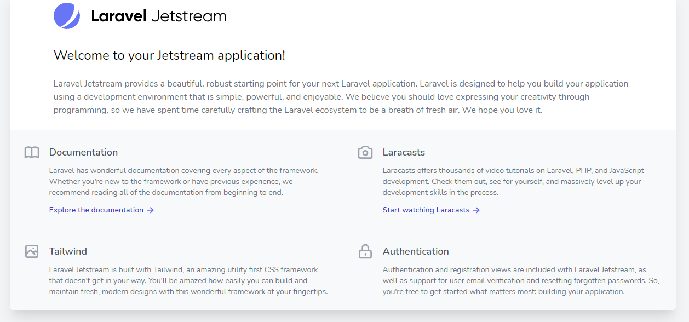
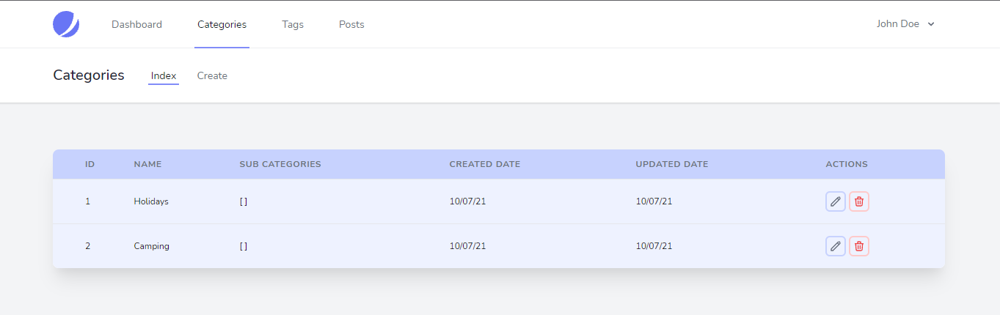
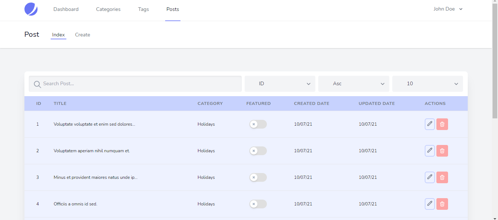

## Dashboard

## Installation and Running app
- git clone https://github.com/savalone47/Laravel-Jetstream-dashboard.git
- cd Laravel-Jetstream-dashboard
- create a database blog 
- composer install
- npm install
- php artisan migrate:fresh --seed
- php artisan serve => localhost:8000

## Connexion 
Admin
- email:john@example.com
- password: password

## Security Vulnerabilities

If you discover a security vulnerability within Laravel, please send an e-mail to Taylor Otwell via [taylor@laravel.com](mailto:taylor@laravel.com). All security vulnerabilities will be promptly addressed.

## License

The Laravel framework is open-sourced software licensed under the [MIT license](https://opensource.org/licenses/MIT).
